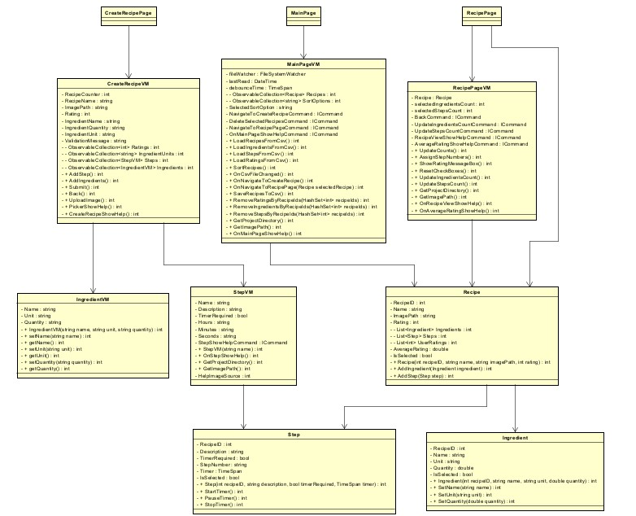

# **CookOff**

## Introduction
This document serves as a start document and offers an overview for the practical assignment for the "C#2" course. 
The purpose of this course is to teach students how to make use of advanced C# techniques as well of .NET MAUI.

## Application description
CookOff is a .NET MAUI cooking assistant application which will assist the user in cooking their favourite meal. The user
will have to create their favourite recipes by writing the ingredients and the steps. Additional features that the application
includes are: baking timer at the step required, ability to keep track of ingredients or steps completed, deliciousness 
rating, user rating and also the ability to save everything in CSV files so the recipes are saved. The application will only run on Windows.

## Features
- Recipe creation
- Steps
- Ingredients
- Deliciousness rating
- User rating
- Ability to keep track of ingredients
- Ability to keep track of steps completed
- Baking timer

## MoSCoW Analysis

| Serial Number | Requirement                              | Must have | Should have | Could have | Won't have |
|:-------------:|------------------------------------------|:---------:|:-----------:|:----------:|:----------:|
|      1.       | Creation of recipes, steps, ingredients  |     ✅     |             |            |            |
|      2.       | Ability to keep track of ingredients     |     ✅     |             |            |            |
|      3.       | Ability to keep track of steps completed |     ✅     |             |            |            |
|      4.       | Baking Timer                             |     ✅     |             |            |            |
|      5.       | Image for recipe                         |     ✅     |             |            |            |
|      6.       | Audio cue for the end of timer           |     ✅     |             |            |            |
|      7.       | Rating of recipes                        |     ✅     |             |            |            |
|      8.       | User Authentication                      |           |             |            |     ✅      |
|      9.       | Multiplatform Support                    |           |             |            |     ✅      |

## Coding Features
As part of the course and in order to implement some of the features, the project will use a variety of. These include the following:

- GitHub for Version Management
- .NET 8 or older 
- .NET MAUI
- MVVM

## Definition of done
The project is done, when the following requirements are met:

- The application works as described above.
- All the must have functionalities from the MoSCow Analysis have been implemented

## Class Diagram

## About the developers
| Name              | Student email                                                                               |
|-------------------|---------------------------------------------------------------------------------------------|
| Arian Atapour     | [arian.atapour@student.nhlstenden.com](mailto:arian.atapour@student.nhlstenden.com)         |
| Evald Narkevicius | [evald.narkevicius@student.nhlstenden.com](mailto:evald.narkevicius@student.nhlstenden.com) |
| Jadyn Jacques     | [jadyn.jacques@student.nhlstenden.com](mailto:jadyn.jacques@student.nhlstenden.com)         |
| Terry Ioannou     | [terry.ioannou@student.nhlstenden.com](mailto:terry.ioannou@student.nhlstenden.com)         |